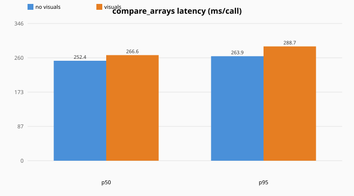
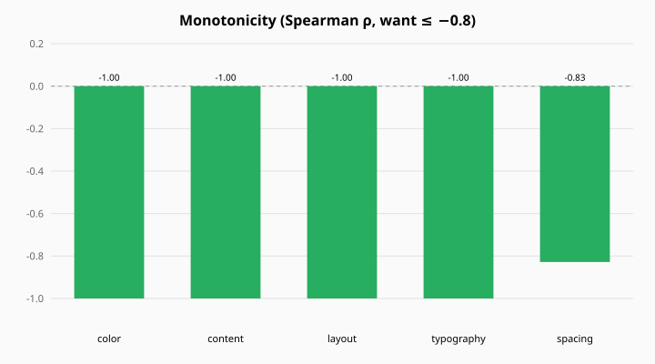
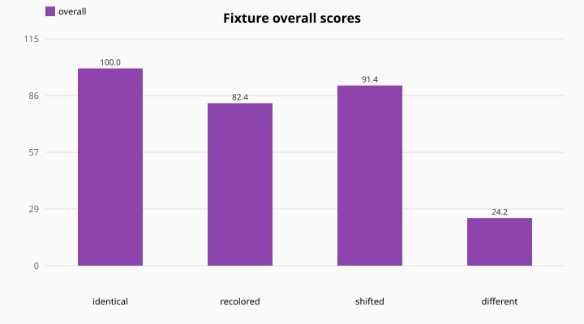
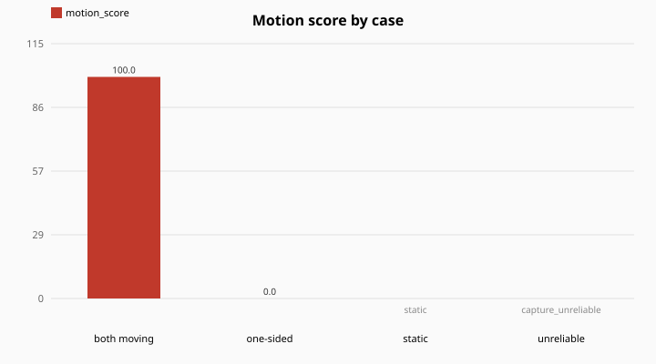

# design-compare-mcp

An MCP server that measures **how faithfully one UI reproduces another** — a reference design vs. an
implementation — and returns a score plus a concrete, actionable punch-list of what's off. It exists
to drive an iterative *"hill-climb the clone"* loop: an agent renders its implementation, compares it
to the goal, fixes the biggest discrepancies, and repeats.

**Website:** [codenameakshay.github.io/design-compare-mcp](https://codenameakshay.github.io/design-compare-mcp/) — overview, the five dimensions, install steps, and live interactive demos ([source in `site/`](site/)).

It compares along two axes most tools ignore in combination:

- **Static fidelity** (`compare_designs`) — layout, color, content, typography, spacing of a still frame.
- **Motion fidelity** (`compare_motion` + `capture_frames`) — whether animations move with similar
  energy and rhythm over time. A screenshot can't see motion; a component library often lives or dies by it.

This document is a deep dive: what each score means, exactly how it's computed, how it was calibrated
against human judgment, and — importantly — **where it is weak and can mislead you**. If a number
looks wrong, the [Calibration](#calibration-is-it-any-good) and [Known limitations](#known-limitations--how-it-can-be-wrong)
sections are written so you can tell whether it's the UI or the tool.

See [PLAN.md](PLAN.md) for the original design rationale and [calibration/README.md](calibration/README.md)
for the calibration workflow.

## Contents

- [The idea](#the-idea)
- [Install & register](#install--register)
- [The tools](#the-tools)
- [How a comparison works (the pipeline)](#how-a-comparison-works-the-pipeline)
- [The five dimensions](#the-five-dimensions)
- [Aggregation: weighted geometric mean](#aggregation-weighted-geometric-mean)
- [Presets & weights](#presets--weights)
- [Reading the diagnostic images](#reading-the-diagnostic-images)
- [Motion comparison](#motion-comparison)
- [Calibration: is it any good?](#calibration-is-it-any-good)
- [Known limitations & how it can be wrong](#known-limitations--how-it-can-be-wrong)
- [Architecture](#architecture)
- [Hardening, determinism & trust model](#hardening-determinism--trust-model)
- [Configuration](#configuration)
- [Benchmark](#benchmark)
- [Development](#development)
- [Repo layout](#repo-layout)

## The idea

You have a **reference** (a design, a website, a component library) and a **candidate** (your
implementation — an app screenshot, a Flutter/React render, a cropped widget). You want a number that
goes **up as the candidate gets closer**, and a list of **what to change** to raise it.

The core design principle: **the score's job is to be actionable and monotonic, not to be a single
"accurate" truth.** A comparison returns:

- an **`overall`** 0–100,
- five **sub-scores** (each 0–100, or `null` when a dimension doesn't apply to the pair),
- **`cv_findings`** — the punch-list (specific colors, missing/extra elements, spacing/text mismatches),
- **diagnostic images** the calling model can look at,
- a **`critique_rubric`** telling the host how to turn all of that into a prioritized fix list.

## Install & register

Requirements: **Node ≥ 20**, **Python ≥ 3.10**, and (for `capture_frames`) a local **Chrome/Chromium**.

```bash
npm install
npm run build                         # tsc -> dist/
python3 -m venv worker/.venv
worker/.venv/bin/pip install numpy pillow scikit-image opencv-python-headless scikit-learn scipy
npm run smoke                         # end-to-end check; ends with ALL CHECKS PASSED ✅
```

Register with Claude Code (user scope = available in every project):

```bash
claude mcp add design-compare --scope user -- node /abs/path/to/design-compare-mcp/dist/index.js
```

Rebuild (`npm run build`) and restart your session after any change — the registered server runs the
built `dist/`.

## The tools

Four tools: `ping`, `compare_designs`, `compare_motion`, `capture_frames`.

### `compare_designs` — static comparison

Inputs: `reference` (path), `candidate` (path), `mode` (`"widget"` | `"screen"`), optional
`preset` (`"default"` | `"dark-ui"`), `weights`, `ignoreRegions`, `returnVisuals`.

`ignoreRegions` are `[x, y, w, h]` boxes in **original reference image pixels** (before the
768 px normalization). Finding boxes in `cv_findings` are reported in the **canonical 768-wide**
canvas space — use the returned `canvas` mapping to translate between the two.

Example — comparing a reference card screen against a version with recolored accents:

```jsonc
// compare_designs(reference="reference.png", candidate="recolored.png", mode="screen")
{
  "overall": 82.4,
  "subscores": {
    "layout":     { "score": 99.97, "reason": "structural similarity (SSIM) after alignment",
                    "measurements": { "ssim": 0.9997, "alignment": { "method": "ecc_translation", "cc": 1.0, "dx": -0.0, "dy": -0.0 } } },
    "color":      { "score": 43.95, "reason": "dominant-palette match (mean ΔE2000)",
                    "measurements": { "mean_delta_e": 15.62, "palette_size": [6, 6], "top_deltas": [45.2, 28.6, 18.2, 1.6] } },
    "content":    { "score": 100.0, "reason": "reference-region coverage (IoU matching)",
                    "measurements": { "coverage": 1.0, "ref_regions": 8, "cand_regions": 8, "missing": 0, "extra": 0 } },
    "typography": { "score": null,  "reason": "text amount + scale (coarse; not font identity)",
                    "measurements": { "note": "no text detected in either image" } },
    "spacing":    { "score": 100.0, "reason": "block margins + vertical rhythm (coarse)" }
  },
  "cv_findings": [
    { "area": "color", "type": "color_shift", "severity": "high",
      "observed": "a dominant color reads as #dc3c3c but the reference uses #2878dc (ΔE 45)",
      "suggested_fix": "shift #dc3c3c toward #2878dc" },
    { "area": "color", "type": "color_shift", "severity": "high",
      "observed": "a dominant color reads as #78283c but the reference uses #283c78 (ΔE 29)",
      "suggested_fix": "shift #78283c toward #283c78" }
  ],
  "preset": "default",
  "weights": { "layout": 0.35, "color": 0.2, "content": 0.15, "typography": 0.15, "spacing": 0.15 }
}
```

Read it as: **layout and content are perfect (same shapes, all elements present), but color is badly
off (mean ΔE 15.6, worst pairs ΔE 45/29)** — and the findings say exactly which hex to change to which.
`typography` is `null` because this screen has no text; that dimension is simply excluded from `overall`.

Findings locate structural problems too. Removing the CTA button from the candidate yields:

```jsonc
{ "area": "content", "type": "missing_region", "severity": "high", "box": [229, 1150, 312, 92],
  "observed": "a reference region at x=229,y=1150 (312x92) is absent",
  "suggested_fix": "add the missing element at this position" }
```

### `compare_motion` — temporal comparison

Inputs: `reference`, `candidate` (each a **directory of frames** or an **array of frame paths**
captured over time), optional `maxFrames`, `returnVisuals`.

```jsonc
// compare_motion(reference="loader/ref_frames", candidate="loader/cand_frames")
{
  "ref_energy": 0.00474,     // motion in the reference (mean per-frame change)
  "cand_energy": 0.00288,    // motion in the candidate
  "energy_ratio": 0.607,     // min/max — do they animate a similar amount?
  "temporal_corr": 0.639,    // do they move at the same times/rhythm? (null for steady motion)
  "ref_moving": true, "cand_moving": true,
  "motion_score": 60.7       // 0 if one animates and the other is static
}
```

Read it as: **both animate, at a correlated rhythm, but the candidate's loader moves ~40% less** than
the reference's.

### `capture_frames` — get frames for `compare_motion`

Inputs: `url` (**http or https only**), optional `frames`, `intervalMs`, `clip` (crop to a preview),
`viewport`, `waitMs`, `waitForFlutter` (waits for `<flutter-view>` to mount — the outcome is always
reported as `flutterWait`), `actions` (ordered click/hover/wait steps to navigate an SPA or trigger
an interaction before sampling), `outDir`. Drives headless Chrome, writes a PNG sequence, and returns
the output `dir` plus first/last sample frames to confirm the capture isn't blank. **`frames: 1`**
captures a still (pass the frame path to `compare_designs`). When `DESIGN_COMPARE_ALLOWED_ROOTS` is
set, `outDir` must lie inside one of those roots (server-created temp dirs are always allowed).

### The motion flow — fully agent-driven

```
capture_frames(url = reference-component-url, clip = {…})                       → dir_ref
capture_frames(url = candidate-url, waitForFlutter = true,
               actions = [{click:[x,y], wait:1500}], clip = {…})                → dir_cand
compare_motion(reference = dir_ref, candidate = dir_cand)
```

## How a comparison works (the pipeline)

`compare_designs` runs a fixed pipeline. Understanding the stages is the key to trusting (or
distrusting) a score.

1. **Load** — decode both images to RGB. Inputs are size-capped *before* decode (see [hardening](#hardening-determinism--trust-model)).
2. **Normalize** — resize both to a canonical width (**768 px**, aspect preserved), then pad the shorter
   to the taller so metrics operate on equal-sized canvases. A height/aspect divergence is recorded and
   surfaced as an `aspect_mismatch` finding rather than silently distorting the score.
3. **Align** — register the candidate onto the reference:
   - `screen` mode → ECC translation (`cv2.findTransformECC`), falling back to identity if it doesn't
     converge (flagged in diagnostics);
   - `widget` mode → identity (a tight crop is assumed pre-aligned).
4. **Score five dimensions** — each in isolation. A metric that throws on a degenerate input marks
   that dimension **`failed`** with score floored at **1.0** and still contributes to `overall`; a
   dimension that doesn't apply returns `null` and is excluded.
5. **Aggregate** — weighted geometric mean over the scored dimensions.
6. **Visuals** — render diagnostic images (unless `returnVisuals:false`).

**Only `layout` uses the aligned candidate.** SSIM is hypersensitive to a 1-px offset, so the global
shift is registered away and layout measures *shape*. The other four run on the **unwarped** candidate
on purpose: color/typography are alignment-invariant, and content/spacing must stay position-sensitive
so a genuine misplacement surfaces as a *spacing/placement* finding instead of being silently
corrected. This also avoids warp-interpolation artifacts contaminating those dimensions.

**Modes.** `widget` = a tight crop of one component, strict, no alignment. `screen` = a full view,
tolerant, auto-aligned. Choose `widget` when you can crop to the exact component (best signal); `screen`
for whole pages.

## The five dimensions

| Dimension | Default weight | Measures | Goes down when… | Known weakness |
|---|---|---|---|---|
| **layout** | 0.35 | structural similarity | shapes/structure differ, blur, alignment fails | grayscale (blind to color); plateaus under heavy blur |
| **color** | 0.20 | dominant-palette match | palette/hue/brightness differ | near-useless in a single-theme UI (no palette variance); ignores position |
| **content** | 0.15 | are the reference's blocks present & placed | elements missing/extra/moved | coarse segmentation; region boxes wobble |
| **typography** | 0.15 | amount + scale of text | more/less text, larger/smaller type | **not** font identity; `null` when no text |
| **spacing** | 0.15 | margins + vertical rhythm | margins/gaps differ | coarsest; `null` on sparse views; full-width blocks zero the L/R margins |

Details of each:

- **layout (structure).** SSIM (`skimage.metrics.structural_similarity`) on the aligned grayscale
  images; window clamped to `min(7, h, w)` so thin/tiny canvases don't error. Score = `clamp(SSIM,0,1)×100`.
  The SSIM difference map also drives the diff-heatmap visual.
- **color.** Deterministic k-means (k=6, fixed seed) extracts a dominant palette in **CIELAB** from
  each image (downsampled to 160 px wide). Reference and candidate palettes are matched one-to-one by
  minimum **ΔE2000** (Hungarian assignment). `mean_delta_e` is the mean matched ΔE; score =
  `100 × exp(−mean_ΔE / 19)` (ΔE 0→100, ≈13→51, ≈25→27). Findings name each shifted pair as hex.
  Alignment-invariant by design (global palette), so it says nothing about *where* colors are.
- **content-presence.** A **contrast-adaptive** detector (Otsu-thresholded brightness delta from the
  modal background, **unioned** with a gradient/edge mask) segments major blocks, morphologically
  closed and connected-component-labeled. Reference regions are matched to candidate regions by IoU ≥ 0.3;
  score = `100 × coverage × (1 − 0.5·min(1, extra_ratio))`. Unmatched reference regions become
  `missing_region` findings (with boxes); unmatched candidate regions become `extra_region`. Returns
  `null` if the reference has no detectable blocks.
- **typography.** Text lines are found by morphology (gradient → Otsu → wide horizontal close →
  aspect/size filter) — **not** OCR or font matching. Score blends text *amount* (foreground area
  fraction) and *scale* (median line height) as min/max ratios. Font family/weight is explicitly left
  to the host's vision model. `null` when neither side has detectable text.
- **spacing.** From **major** blocks only (a larger min-area than content, so inner text/detail doesn't
  dilute it): outer margins (left/right/top/bottom, normalized) + mean inter-block vertical gap. Each
  feature is compared with a tolerance (a 12%-of-dimension difference = full miss); score = mean of the
  per-feature similarities. `null` when there are too few major blocks to assess rhythm.

## Aggregation: weighted geometric mean

`overall` is the **weighted geometric mean** over the dimensions that scored (non-`null`), with weights
renormalized across that subset and each score floored at 1.0:

```
overall = exp( Σ (wᵢ / Σw) · ln(clamp(scoreᵢ, 1, 100)) )
```

Why geometric, not arithmetic: a **weak dimension drags the whole score down** far more than an average
would, so you **can't farm one dimension to mask a broken one** (a color-perfect but structurally-wrong
clone still scores low). This is verified by a gaming test in the suite (a `{layout:12, color:100, …}`
input scores ~35 geometric vs ~56 arithmetic). Dimensions that are `null` are simply excluded, so
identical inputs score ~100 whether or not every dimension applies.

## Presets & weights

The default weights are a balanced starting point, **not** a universal truth — the right weighting
depends on the domain (see [Calibration](#calibration-is-it-any-good)).

- **`default`** — `layout 0.35, color 0.20, content 0.15, typography 0.15, spacing 0.15`.
- **`dark-ui`** — `layout 0.60, typography 0.30, color 0.10, content 0, spacing 0`. Calibrated on a
  dark, single-theme component-library port: layout-dominant, color down-weighted (no palette
  variance), content/spacing off. Raised correlation with human labels from ~0 to ~0.44 on that dataset.

Pass `preset: "dark-ui"`, or override any dimension with explicit `weights` (which take precedence over
the preset). The resolved preset + weights are echoed back in every result for transparency.

## Reading the diagnostic images

`compare_designs` returns up to four images (as MCP image blocks); `compare_motion` returns one:

- **overlay** — reference and aligned candidate blended 50/50; ghosting shows where they diverge.
- **diff_heatmap** — the SSIM difference map; **hot = larger structural divergence**. (Omitted if the
  layout metric couldn't run.)
- **content_regions** — two panes when extras exist: matched/missing on the reference, extras on the candidate. Green = matched, red = missing, orange = extra.
- **side_by_side** — reference and candidate at matched size, for a direct human look.
- **motion_signature** — line chart of per-frame motion over time: **green = reference, blue =
  candidate**. Compare curve height (intensity) and shape (timing).

## Motion comparison

A single frame can't measure animation, so `compare_motion` compares two **frame sequences**:

- **Signature** — for each consecutive frame pair, the mean absolute grayscale change (0–1). The series
  over time is the component's *motion signature*.
- **Motion energy** — mean of the signature: how much it animates. Below ~0.0008 a side is "static."
- **`motion_status`** — `compared` (a numeric `motion_score` is meaningful), `static` (both sides
  below the motion threshold), or `capture_unreliable` (blank/near-uniform frames). Read this before
  trusting `motion_score`.
- **`motion_score`** — when `motion_status` is `compared`, the energy ratio `min/max × 100` (similar
  animation amount), **0 if one animates and the other is static**. When status is `static` or
  `capture_unreliable`, the score is **`null`** — never a fake 100.
- **`temporal_corr`** — Pearson correlation of the two signatures (do they move at the same *times*);
  `null` for steady motion that has no temporal profile to correlate.

It is **content-agnostic** — it measures change over time, not appearance — so it works even when the
two sources render different example content, which is exactly what blocks frame-by-frame appearance
comparison.

## Calibration: is it any good?

This is the part to read critically. The tool was calibrated against **human labels** on a real dataset:
26 components of a dark motion-component library (beUI) vs. its Flutter port, each scored 0–100 by eye
(blind to the tool's output). Correlation is **Spearman** (does the tool *rank* ports the way a human
does?).

| Configuration | Spearman vs. human labels |
|---|---|
| `default` preset, out of the box | **−0.03** — essentially no correlation |
| `default` preset, after fixing dark-UI segmentation | **+0.14** |
| **`dark-ui` preset** | **+0.44** |
| best possible weighting (search over 3 dims) | +0.54 *(overfit to 26 points — treat as a ceiling, not a setting)* |

Per-dimension correlation with human judgment **on that dataset**:

| Dimension | Spearman | Reading |
|---|---|---|
| layout | **+0.33** | the strongest single predictor |
| typography | **+0.31** | comparably useful |
| content | +0.23 | useful after the dark-UI fix (was −0.02 noise before) |
| color | +0.03 | **useless here** — single dark theme, no palette variance to read |
| spacing | −0.13 | weak/noisy on sparse dark previews |

**What this tells you honestly:** on a dark, single-theme, motion-heavy library, the tool is a *decent
layout+typography checker* (≈+0.44 tuned) and **not** a full fidelity oracle. On a light, multi-theme,
static UI, color and content would carry much more signal — which is the whole point of per-domain
calibration.

**Re-calibrate for your own UI:** drop `(reference, candidate, your 0–100 label)` pairs into
`calibration/` and run `worker/.venv/bin/python scripts/calibrate.py`. It reports per-dimension
Spearman, the baseline, and a weight search. 15–30 pairs spanning the quality range gives a meaningful
number; fewer is directional only.

## Known limitations & how it can be wrong

Read this before trusting any single number.

- **The motion ceiling (biggest one).** A static screenshot cannot see animation. On the calibration
  set, *every one of the 8 largest tool-vs-human disagreements was a motion/interaction component* the
  static tool **over-scored** (e.g. animated-toast-stack: human 25, tool 80; tooltip: 50 vs 87). If a
  component's fidelity is mostly about motion, `compare_designs` will look too kind — use
  `compare_motion`.
- **Color is near-useless in a single theme.** With everything on one dark palette there's no variance
  for ΔE to read (rho +0.03). Don't weight color on such UIs (the `dark-ui` preset zeroes it low).
- **content & spacing are coarse.** They rely on pixel segmentation with no DOM. They were *completely
  broken* on low-contrast dark UIs until the adaptive detector (they returned 0/`null` for everything);
  they now work but region boxes still wobble, and spacing goes `null` on sparse previews.
- **typography is amount + scale, not font.** It will not notice a wrong font family or weight — that's
  deliberately left to a vision model. Two very different fonts at the same size and density score high.
- **One-shot animations under `capture_frames`.** Frames are sampled at a fixed cadence after load, so a
  count-up or text-reveal that finishes before sampling reads as *static* — a low `motion_score` can
  mean "not captured," not "not faithful." Continuous animations (spinners, marquees, shaders) are fine.
- **Flutter/CanvasKit in headless capture.** A CanvasKit render can screenshot black or fail to boot in
  an offscreen browser; the DOM/HTML renderer captures reliably. If frames are blank, that's a capture
  issue, not zero motion.
- **The correlation number itself.** +0.44 is *moderate* and measured on n=26 — meaningful but not
  authoritative. The tool is a fast, reproducible **first-pass gate and punch-list generator**, not a
  substitute for a human's final judgment.
- **Different example content.** If the two sources show different sample data (a `select` showing
  "Next.js" vs "Pick a fruit"), the static comparison is partly apples-to-oranges. `compare_motion` is
  content-agnostic and unaffected.

## Architecture

```
Host agent ──MCP/stdio──► TS server ──spawns once──► Python vision worker (persistent)
                              │
                              └── capture_frames → headless Chrome (puppeteer-core)
```

- **TS server** (`src/`) speaks MCP over stdio, registers the tools, drives `capture_frames` directly
  (browser work is a Node concern), and supervises the Python worker.
- **Python worker** (`worker/vision_worker/`) does all vision (OpenCV, scikit-image, scikit-learn). It
  stays **resident** so heavy imports load once, not per call. TS ↔ Python speak newline-delimited JSON;
  the worker's stdout is a clean protocol channel and all diagnostics go to stderr.

## Hardening, determinism & trust model

- **Deterministic scores.** Same inputs → identical output (k-means is seeded; no randomness in the
  metrics). This is what makes the score safe to hill-climb against.
- **Supervised worker.** If the Python worker dies (OOM, native crash), the next request lazily
  respawns it with backoff; a previously-healthy crash triggers one idempotent retry. One crash costs a
  single failed call, never the session.
- **Per-metric isolation.** A dimension that throws on a degenerate input is marked `failed` with score
  floored at 1.0 (error in `measurements`); the others and `overall` still compute. Not-applicable
  dimensions return `null` and are excluded from the geo-mean.
- **Input caps.** Images larger than ~40 MP / 12000 px per side are rejected *before* decode (bounding
  memory); PIL's decompression-bomb guard is a backstop; non-images and bad paths return typed errors.
- **Protocol isolation.** The worker reserves the real stdout fd for framed JSON and repoints
  `sys.stdout`/fd 1 at stderr, so stray library output can never corrupt the channel.
- **Trust model.** The tools read local image paths and (for `capture_frames`) navigate to URLs you
  give them; a local single-user assumption. They never return raw file bytes (non-images error out).
  For an untrusted/multi-tenant host, set `DESIGN_COMPARE_ALLOWED_ROOTS` to restrict file reads.

## Configuration

- `DESIGN_COMPARE_PYTHON` — Python interpreter for the worker. Defaults to `worker/.venv/bin/python` if
  present, else `python3`.
- `DESIGN_COMPARE_CHROME` — Chrome/Chromium executable for `capture_frames`. Auto-detected on
  macOS/Linux/Windows if unset.
- `DESIGN_COMPARE_ALLOWED_ROOTS` — optional path-separated directories (`:` on macOS/Linux, `;` on Windows). When set, file reads and `capture_frames` `outDir` outside them are refused (after resolving symlinks). Unset = any local path.

## Benchmark

Rerunnable on this machine via `npm run bench` (writes `docs/bench/results.json` and SVG charts).
Numbers below are from the last local run; re-run to refresh after code changes.

| Metric | Result |
|---|---|
| Latency (`visuals=false`, p50 / p95) | **252 / 264 ms/call** |
| Latency (`visuals=true`, p50 / p95) | 267 / 289 ms/call |
| RSS growth (80 in-process calls, visuals=true) | +1.1 MB |
| Monotonicity Spearman (color / layout / spacing) | −1.00 / −1.00 / −0.83 |
| Gaming (geo vs arith on `{layout:12, color:100, …}`) | **34.6 vs 56.0** |
| ignoreRegions (without → with ignore) | 51.1 → 80.2 (+29.1) |
| Motion: both-moving / one-sided / static / unreliable | 100 / 0 / null / null |
| Fixture overall: identical / recolored / shifted / different | 100 / 82.4 / 91.4 / 24.2 |









See [`docs/bench/results.json`](docs/bench/results.json) for the full structured output.

## Development

```bash
npm test             # build + four Python test scripts + smoke + resilience
npm run bench        # latency, RSS, monotonicity, gaming, ignoreRegions, motion → docs/bench/
npm run build        # tsc -> dist/
npm run smoke        # end-to-end over the MCP client: all four tools
npm run resilience   # worker crash/restart + concurrency
npm run lifecycle    # server + worker exit when the host goes away (no orphans)
```

CI (`.github/workflows/ci.yml`) runs `npm run build`, the four Python test scripts, and `npm run smoke`
on every PR and push to `main`. Chrome is not required in CI — `capture_frames` smoke checks skip when
Chrome is absent.

Individual Python tests (also run by `npm test`):

```bash
worker/.venv/bin/python worker/tests/test_pipeline.py
worker/.venv/bin/python worker/tests/test_calibration.py
worker/.venv/bin/python worker/tests/test_robustness.py
worker/.venv/bin/python worker/tests/test_motion.py
```

Calibration helpers: `scripts/capture_pairs.mjs` (capture reference/candidate pairs),
`scripts/build_contact_sheet.py` (blind labeling sheet), `scripts/calibrate.py` (score labels + tune
weights), `scripts/capture_frames.mjs` + `scripts/motion_score.py` (motion).

## Repo layout

```
src/                       # TypeScript MCP server
  index.ts                 #   tool registration (ping, compare_designs, compare_motion, capture_frames)
  worker-client.ts         #   supervises + multiplexes the Python worker
  capture.ts               #   headless-Chrome frame capture (capture_frames)
  schema.ts                #   zod input schemas
  path-and-url-guard.ts    #   http(s) URLs + DESIGN_COMPARE_ALLOWED_ROOTS
worker/vision_worker/      # Python vision worker
  pipeline.py              #   compare / compare_arrays / compare_motion orchestration
  normalize.py align.py    #   canonical-size + registration
  metrics/                 #   structure, color, content, typography, spacing
  aggregate.py             #   weighted geometric mean + presets
  motion.py                #   motion signature + sequence comparison
  visuals.py io_utils.py   #   diagnostic images + image/frame loading
scripts/                   # calibration + motion + resilience/stress helpers
calibration/               # dataset manifest, labeling sheet, (gitignored) captured pairs
worker/tests/              # pytest-free assert scripts (run directly)
PLAN.md                    # original design + phase plan
```
